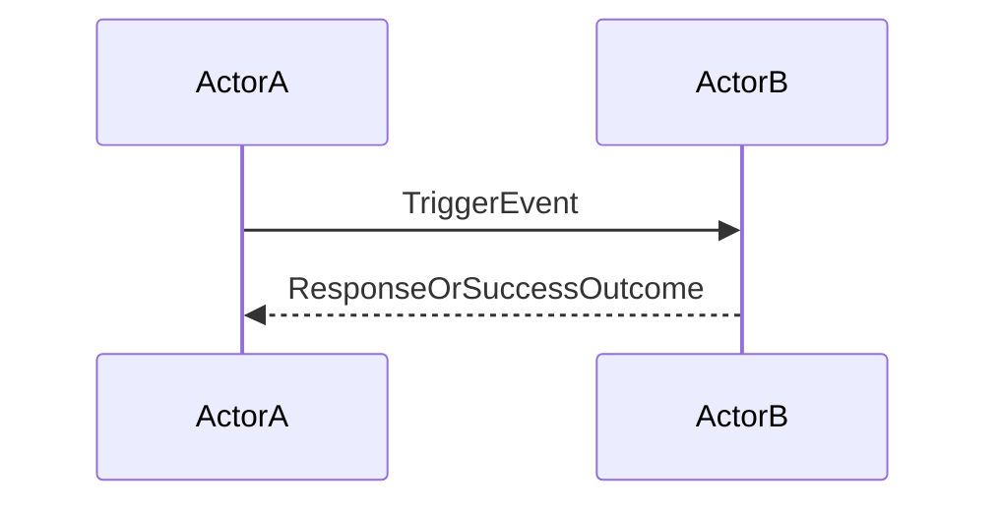

# End-to-end flow

This file is the end-to-end customer flow diagram for the Initiative. Required content is sourced from `docs/HANDOVERS.md` §"Handover 5: Initiative → Spec" → §"Required content" item 2.

## End-to-end customer flow <!-- source: HANDOVERS-5 §"Required content" item 2 -->

> Replace `ActorA`, `ActorB`, `TriggerEvent`, and `ResponseOrSuccessOutcome` with the real actor names and event labels for this initiative. Angle-bracket placeholder syntax breaks Mermaid's tokenizer — use bare CamelCase identifiers inside the fenced block, then describe the substitutions in the caption prose below.

<One-paragraph caption: name the <trigger event>, the <actors involved>, and the <success outcome> that the diagram above depicts. Angle-bracket placeholders are fine in this caption prose; the constraint only applies inside the fenced Mermaid block.>
