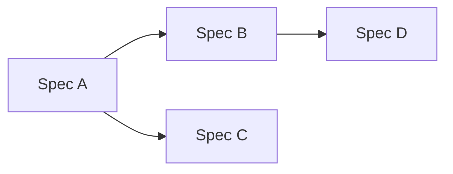

# Delivery sequence

This file is the dependency-aware delivery DAG for the Initiative's child specs, plus the first-shippable-subset callout. Required content is sourced from `docs/HANDOVERS.md` §"Handover 5: Initiative → Spec" → §"Required content" item 4.

## Delivery sequence <!-- source: HANDOVERS-5 §"Required content" item 4 -->

> Replace `SpecA`/`SpecB`/`SpecC`/`SpecD` with real spec slugs from [`child-specs.md`](./child-specs.md). Angle-bracket placeholder syntax breaks Mermaid's tokenizer — use bare alphanumeric node IDs inside the fenced block.

**First shippable subset:** <list of spec slugs that compose the smallest viable end-to-end ship>
